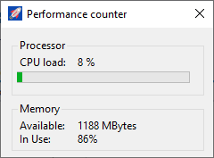

WinForms application uses performance counter

Created in Visual Studio 2019 using Windows Forms App template (.NET 5).   
Automatic data update is done using a Timer.   
CPU and Memory data is taken from PerfomanceCounter class.